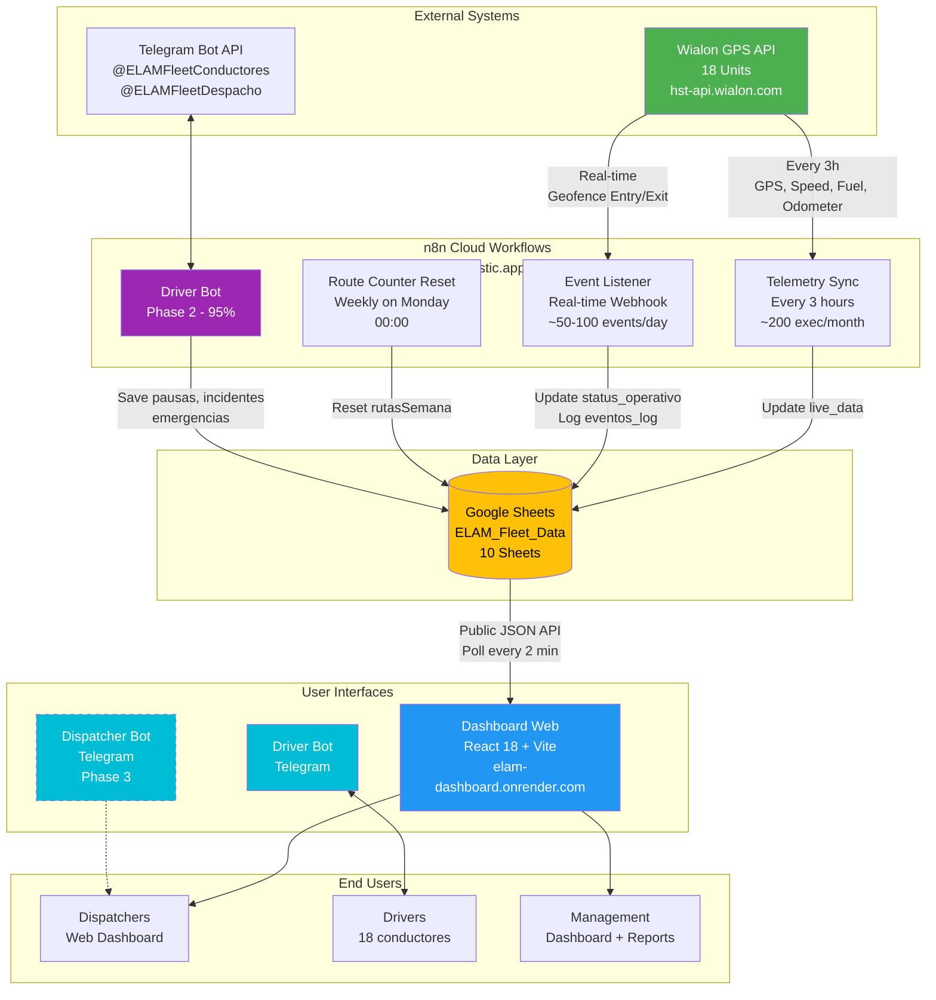
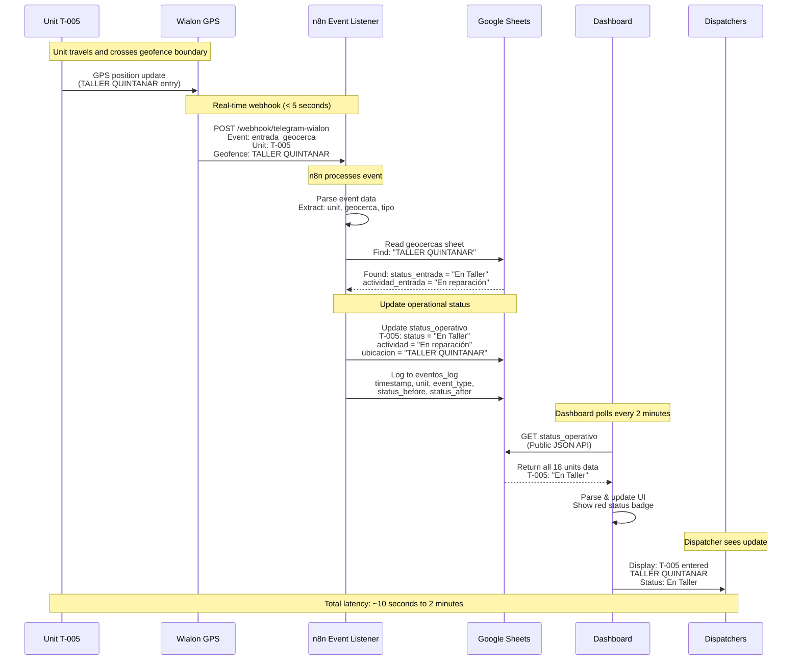
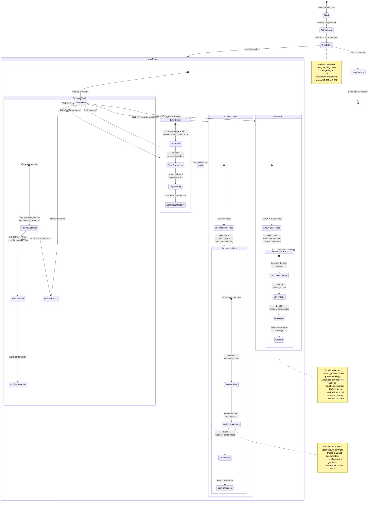
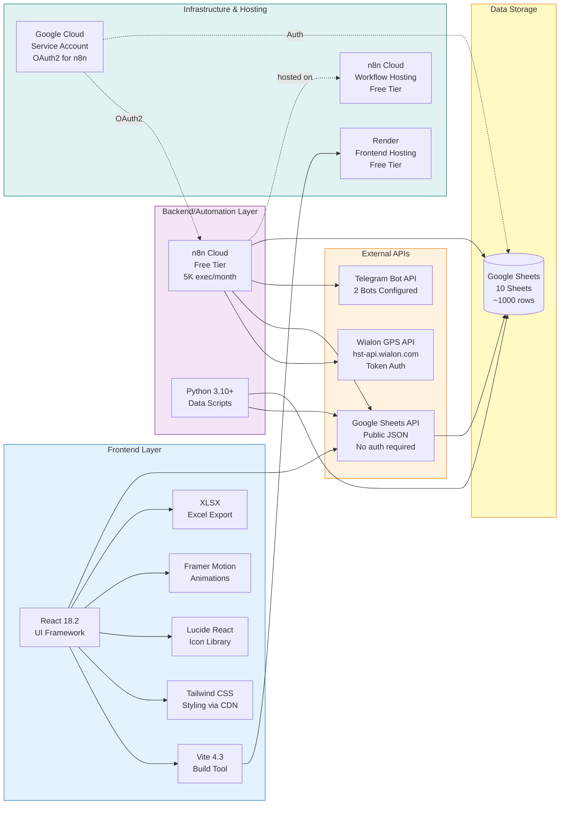
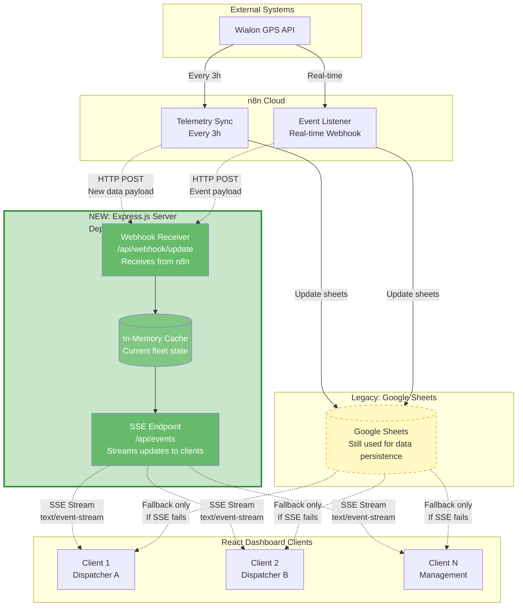

# ELAM Fleet Management System - Architecture Diagrams

**Project:** ELAM Logistics Dashboard
**Version:** 2.0 (Production)
**Last Updated:** December 9, 2025

---

## Overview

This document provides visual architecture diagrams for the ELAM Fleet Management System using Mermaid syntax. These diagrams render automatically on GitHub and provide a clear understanding of the system architecture, data flows, and technology stack.

---

## Table of Contents

1. [System Architecture (Current v2.0)](#1-system-architecture-current-v20)
2. [Data Flow Sequence (Geofence Event)](#2-data-flow-sequence-geofence-event)
3. [Telegram Bot State Machine](#3-telegram-bot-state-machine-driver-bot-phase-2)
4. [Technology Stack](#4-technology-stack)
5. [Future Architecture (with SSE)](#5-future-architecture-with-sse-push-notifications)

---

## 1. System Architecture (Current v2.0)

### Purpose
Shows the complete system architecture with all major components, data flows, and update frequencies.

### Diagram



### Legend
- **Solid lines:** Active data flows
- **Dashed lines:** Planned (Phase 3)
- **Colors:**
  - Green: External APIs
  - Yellow: Data storage
  - Blue: Web interfaces
  - Cyan: Telegram bots
  - Purple: In-progress features

### Key Components

**External Systems:**
- **Wialon GPS API:** Professional GPS tracking platform providing telemetry data
- **Telegram Bot API:** Messaging platform for driver/dispatcher communication

**n8n Workflows:**
- **Workflow 1 (Telemetry Sync):** Fetches GPS data every 3 hours for all 18 units
- **Workflow 2 (Event Listener):** Processes real-time geofence events via webhook
- **Workflow 3 (Route Counter):** Resets weekly trip counter every Monday
- **Workflow 4 (Driver Bot):** Handles driver interactions (pause, incidents, emergencies)

**Data Storage:**
- **Google Sheets:** 10-sheet database (status_operativo, live_data, geocercas, eventos_log, etc.)
- **Public API:** Allows dashboard to fetch data without authentication

**User Interfaces:**
- **Web Dashboard:** React-based real-time monitoring interface
- **Driver Bot:** Telegram bot for driver interactions (95% complete)
- **Dispatcher Bot:** Telegram bot for dispatcher commands (planned Phase 3)

---

## 2. Data Flow Sequence (Geofence Event)

### Purpose
Shows the detailed sequence of events when a unit enters or exits a geofence, demonstrating real-time automation.

### Diagram



### Timing Breakdown

| Step | Component | Duration |
|------|-----------|----------|
| GPS → Wialon | Wialon GPS | ~1-3 seconds |
| Wialon → n8n Webhook | Network | ~1-2 seconds |
| n8n Processing | n8n workflow | ~3-5 seconds |
| Google Sheets Update | Sheets API | ~1-2 seconds |
| Dashboard Poll | React app | 0-120 seconds (depending on poll timing) |
| **Total Latency** | **End-to-end** | **~10 sec to 2 min** |

### Notes
- **Real-time webhook:** Geofence events trigger immediately (not waiting for 3-hour sync)
- **Polling delay:** Dashboard checks for updates every 2 minutes, adding 0-120 seconds latency
- **Future improvement:** SSE implementation will reduce latency to <1 second (see Diagram 5)

---

## 3. Telegram Bot State Machine (Driver Bot Phase 2)

### Purpose
Shows the conversation flow and state transitions for the driver Telegram bot.

### Diagram



### Button Callback Patterns

**Main Menu:**
- `pausas` → Show Pause Menu
- `incidentes` → Show Incident Menu
- `emergencia` → Process Emergency
- `ayuda` → Show Help
- `reanudar` → Resume Active Pause

**Pause Types:**
- `pausa_bano` → Bathroom break (10 min)
- `pausa_combustible` → Fuel stop (20 min)
- `pausa_comida` → Meal break (30 min)
- `pausa_descanso` → Rest period (4 hours)

**Incident Types:**
- `incidente_trafico` → Heavy traffic
- `incidente_obra` → Road construction
- `incidente_manifestacion` → Protest/blockage
- `incidente_clima` → Bad weather
- `incidente_mecanica` → Mechanical issue
- `incidente_otro` → Other

### Current Status (Phase 2: 95%)
✅ **Working:**
- User authentication
- Main menu with buttons
- Pause registration flow
- Data persistence to sheets

⚠️ **Needs Fix:**
- Confirmation message chat reference (5 min fix)
- Incident menu buttons missing (10 min)

❌ **Not Tested:**
- Complete incident flow
- Emergency SOS
- Pause resume functionality

---

## 4. Technology Stack

### Purpose
Shows the relationships between technologies, frameworks, and services used in the system.

### Diagram



### Technology Details

#### Frontend Stack
| Technology | Version | Purpose | Why Chosen |
|------------|---------|---------|------------|
| React | 18.2.0 | UI framework | Industry standard, component-based |
| Vite | 4.3.9 | Build tool | 10x faster than Create React App |
| Tailwind CSS | 3.x (CDN) | Styling | Utility-first, no build config |
| Lucide React | Latest | Icons | 263 icons, tree-shakeable |
| Framer Motion | 12.23.24 | Animations | Smooth KPI card animations |
| XLSX | 0.18.5 | Excel export | Dashboard data export |
| date-fns | 4.1.0 | Date handling | Internationalized for Spanish |

#### Backend/Automation
| Technology | Purpose | Why Chosen |
|------------|---------|------------|
| n8n Cloud | Workflow automation | No-code, visual editor, free tier |
| Python 3.10+ | Data processing | KML import, geocerca migration |

#### External APIs
| API | Purpose | Authentication |
|-----|---------|----------------|
| Wialon GPS | Fleet telemetry | Token-based |
| Google Sheets | Data storage | Public read (dashboard), OAuth2 (n8n) |
| Telegram Bot | Driver/dispatcher comms | Bot tokens |

#### Infrastructure
| Service | Purpose | Tier/Cost |
|---------|---------|-----------|
| Render | Frontend hosting | Free |
| Google Cloud | Service account | Free |
| n8n Cloud | Workflow hosting | Free (5K exec/month) |

### Cost Breakdown (Current)
- **n8n Cloud:** $0/month (using 4,500 of 5,000 executions)
- **Render:** $0/month (static site)
- **Google Sheets:** $0/month (within API limits)
- **Wialon API:** [Client's existing subscription]
- **Telegram Bot:** $0/month (unlimited)

**Total Monthly Cost:** $0

### Scaling Costs (Future)
- **n8n Pro (20K exec/month):** $25/month
- **Render Pro (better uptime):** $7/month
- **PostgreSQL Database:** $5-10/month
- **Estimated for 50 units:** ~$40-50/month

---

## 5. Future Architecture (with SSE Push Notifications)

### Purpose
Shows the planned architecture with Server-Sent Events (SSE) for real-time push notifications, eliminating polling delay.

### Diagram



### Key Changes

#### Current Architecture (Polling)
```
Dashboard → Poll every 2 minutes → Google Sheets → Return data
```
- **Requests/hour:** 30 per user
- **Network usage:** High (98% return unchanged data)
- **Latency:** 0-120 seconds (average 60 seconds)
- **Scalability:** Poor (more users = more polling)

#### Future Architecture (SSE)
```
Dashboard → Open SSE connection → Express server → Push updates immediately
```
- **Requests:** 1 initial connection, then stream
- **Network usage:** 98% reduction (only push when changed)
- **Latency:** <1 second
- **Scalability:** Excellent (handles 100+ concurrent connections)

### Implementation Status

**Status:** 📋 Fully Planned, Not Started

**Documentation:** Complete implementation plan in [`docs/technical/PUSH_NOTIFICATIONS_PLAN.md`](PUSH_NOTIFICATIONS_PLAN.md) (1,035 lines)

**Estimated Effort:** 4-6 hours
- Express.js server setup: 1-2 hours
- React SSE client: 1 hour
- n8n webhook updates: 1-2 hours
- Testing & deployment: 1 hour

**Deployment:** Render supports Node.js, can host Express server on same platform as frontend

**Benefits:**
- ✅ Instant updates (<1 second vs 0-120 seconds)
- ✅ 98% reduction in network requests
- ✅ Better scalability (100+ users)
- ✅ Lower battery usage on mobile
- ✅ Graceful degradation (falls back to polling if SSE fails)

**Next Steps:**
1. Complete Phase 2 Telegram bot testing
2. Implement SSE server (4-6 hours)
3. Deploy and test
4. Monitor performance improvements

---

## Related Documentation

### Technical Documentation
- **[Push Notifications Implementation Plan](PUSH_NOTIFICATIONS_PLAN.md)** - Complete SSE implementation guide
- **[Complete Project Documentation](../project/ELAM_Project_Documentation.md)** - Full project overview
- **[Development History](../project/DEVELOPMENT_HISTORY.md)** - Development timeline

### Setup & Deployment
- **[Setup Guide](../setup/SETUP_GUIDE.md)** - Installation instructions
- **[Deployment Guide](../setup/DEPLOYMENT_GUIDE.md)** - Production deployment

### Client Documentation
- **[Spanish Client Brief](../RESUMEN_CLIENTE.md)** - Executive summary in Spanish

---

## Diagram Update Log

| Date | Diagram | Change | Author |
|------|---------|--------|--------|
| 2025-12-09 | All | Initial creation with 5 diagrams | Claude Code |

---

**Document Version:** 1.0
**Last Updated:** December 9, 2025
**Maintained By:** ELAM Development Team
**Render Test:** View this file on GitHub to see Mermaid diagrams rendered
